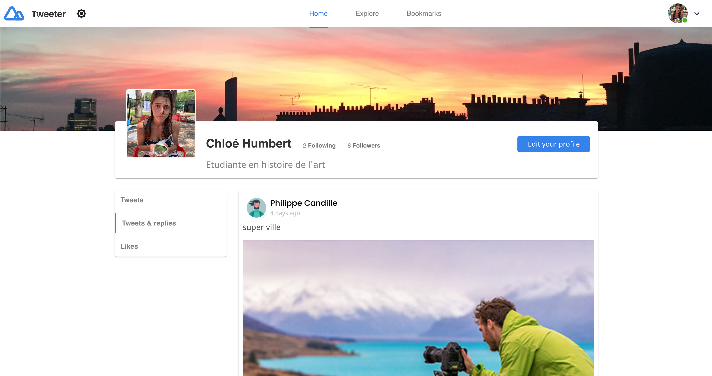
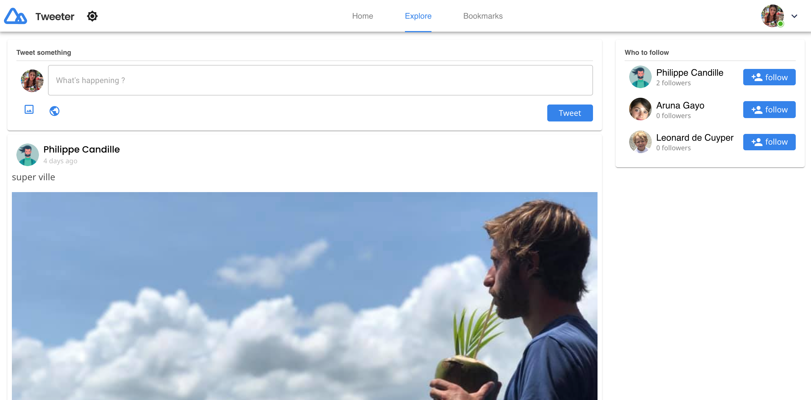

<h1 align="center">Onlygood</h1>

<div align="center">
   Solution for a challenge from  <a href="http://devchallenges.io" target="_blank">Devchallenges.io</a>.
</div>

<div align="center">
  <h3>
    <a href="https://{your-demo-link.your-domain}">
      Demo
    </a>
    <span> | </span>
    <a href="https://{your-url-to-the-solution}">
      Solution
    </a>
    <span> | </span>
    <a href="https://devchallenges.io/challenges/rleoQc34THclWx1cFFKH">
      Challenge
    </a>
  </h3>
</div>

<!-- TABLE OF CONTENTS -->

## Table of Contents

- [Overview](#overview)
  - [Built With](#built-with)
- [Features](#features)
- [How to use](#how-to-use)
- [Contact](#contact)
- [Acknowledgements](#acknowledgements)

<!-- OVERVIEW -->

## Overview 1


## Overview 2




### Built With
This section should list any major frameworks that you built your project using. Leave any add-ons/plugins for the acknowledgements section. Here are a few examples.
* [Node](https://nodejs.org/dist/latest-v12.x/docs/api/)
* [React](https://fr.reactjs.org/)
* [Redux](https://redux.js.org/)
* [Postgres](https://www.postgresql.org/)
* [Sqitch](https://sqitch.org/) => migration database
* [Material UI](https://material-ui.com/)

## Features

<!-- List the features of your application or follow the template. Don't share the figma file here :) -->

This application/site was created as a submission to a [DevChallenges](https://devchallenges.io/challenges) challenge. The [challenge](https://devchallenges.io/challenges/rleoQc34THclWx1cFFKH) was to build an application to complete the given user stories.

<!-- GETTING STARTED -->
## Getting Started

### Prerequisites

This is an example of how to list things you need to use the software and how to install them.
* npm
```sh
npm install npm@latest -g
```

### Installation

1. Clone the repo
```sh
git clone https://github.com/decuyperanthony/star-wars.git
```

2. To init server && Install NPM server packages && start server
```sh
cd server
cp .env.example .env
npm install
npm start
```
3. Install YARN client packages && start server
```sh
cd client
yarn
yarn start
```

## Acknowledgements

<!-- This section should list any articles or add-ons/plugins that helps you to complete the project. This is optional but it will help you in the future. For example: -->

- [Steps to replicate a design with only HTML and CSS](https://devchallenges-blogs.web.app/how-to-replicate-design/)
- [Node.js](https://nodejs.org/)
- [Marked - a markdown parser](https://github.com/chjj/marked)

## Contact

- Website [https://anthonydecuyper.netlify.app/](https://anthonydecuyper.netlify.app/)
- GitHub [@decuyperanthony](https://github.com/decuyperanthony)


## Demo
### Home page
We can follow each other
We can Post comment with pictures

### Explore page
We can comment picture
We can like, saved, retweet picture

We have profile page
In which we can see favorites or saved tweet etc...

### Version Mobile
Profile Page

Explore page


## USER STORIES

- ~~User story: I can see my profile or others' profile~~
- ~~User story: When I am on a profile, I can see Tweets and Retweets. I can also filter by Tweets, Tweets and replies, Media and Likes DONE~~
- User story: When I am on a profile, I can see followers and following
- ~~User story: When I am on a profile, I can see follow or unfollow the user~~
- User story: I can navigate between Home, Explore and Bookmarks
- ~~User story: I can navigate to My Profile, Group Chat (optional), Setting/Authentication App.DONE~~
- ~~User story: When I am on Home, I can post a new Tweet DONE~~
- User story: When I post a new Tweet, I can choose to upload an image and set the Tweet to be public or only-follower MI-DONE
- User story: When I am on Home, I can see Tweets of people who I follow
- ~~User story: I can Comment, Retweet, Like or Save a Tweet DONE~~
- User story: I can Comment with image and I can like a comment
- ~~User story: I can see the posted time of the Comments and Tweets~~
- User story: When I am on Home, I can see the most popular hashtags and people I should follow (it's up to you how to implement this)
- User story: When I am on Explore, I can see the Top, Latest Tweet, or Tweet with Media. I can also choose to see the most popular people
- User story: When I am on Bookmarks, I can see the Saved Tweet
- User story(optional): I can search for a group